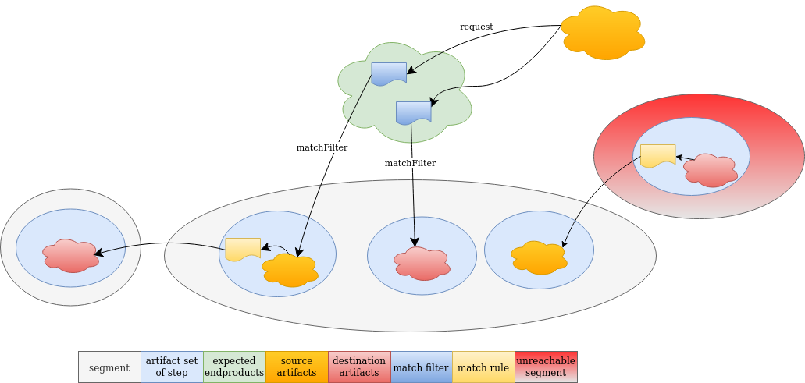

# Verification of the Supply Chain End Products

## Start State

1. There is a SupplyChain defined
2. There are 1 or more active and valid Layouts
    1. The Layouts have only 1 segment
3. A verification request is done with a set of Artifacts
4. The Layouts have a list of expectedEndProducts.
5. The expectedEndProducts are from 1 segment
6. There is a directed graph from the segment with the steps with the expected end products.

### Verify the Artifacts on the request


An example of a `SupplyChain` with a `Layout`



An example of a use case of a `Layout` with several `Segments`

---
Every Layout is processed until one of them has a valid result.

```
    processLayouts
        artifacts = request.artifacts
        resolvedSegments = []
        // a set of sets of links
        linkSets = [[]]
        for every Layout
            matchRules = layout.expectedEndProducts.matchRules
            resolvedSegments, linkSets = processMatchRules(matchRules, artifacts, resolvedSegments, linkSets)
            resolvedSegments, linkSets = processMatchRules(resolvedSegments, linkSets)
            verificationContexts = createVerificationContexts(layout, linkSets)
            for context in verificationContexts
                result = processVerification(context)
                if result is valid
                    return valid
        return invalid
```
---
The goal of `processMatchRules` is to get sets of Link objects of the layout segments which have matched artifacts based on the `matchRules` in the expected end products and the `artifacts` in the verification request. The validation will proof which of these different sets has delivered a valid end product.

The clients should set a runId which is as unique as possible. This runId is used to get all Link objects for steps which aren't a destination of a match filter or rule made during a run.

1. It is possible that the same end products are available in more than 1 different run of the supply chain with different runId's. For example if the run is only different in a disjunct part of all end products or if runs are not complete. Every runId with it's run should be checked on validity.


```
    processMatchRules(resolvedSegments, linkSets)
        destSegment = None
        if resolvedSegments is empty
            stepMap = getFirstStepMap(expectedEndProducts, artifacts)
            if not stepMap is empty
                linkSets = getLinks(segment, stepMap, linkSets)
                destSegment = segment
        else
            ruleMap = getRuleMapToResolveSegment(resolvedSegments)
            if not ruleMap is empty
                for linkSet in linkSets
                    stepMap = getMatchRulesWithArtifacts(ruleMap, resolvedSegments, linkSet)
                    linkSets = getLinks(segment, stepMap, linkSets)
                destSegment = segment
        if destSegment is None
            return resolvedSegments, linkSets
        else
            resolvedSegments.add(destSegment)     
        // next segment  
        return processMatchRules(None, resolvedSegments, linkSets)
            
    getFirstMatchRulesWithArtifacts(expectedEndProducts, artifacts)
        return group expectedEndProducts by src segment, src step, type
 
    getRuleMapToResolveSegment(resolvedSegments)
        return group ruleLists with MatchRules in resolvedSegments by destination segment not resolved, src segment, src step, type
                
    getMatchRulesWithArtifacts(ruleMap, resolvedSegments, linkSet)
        stepMap = {}
        for segment in ruleMap
            for step in segment
                for type in materials, products
                    artifacts = link.type.artifacts
                    stepMap[filter.destStep] = []
                    for rule in rules
                        if ruleType is Match and rule.destSegment is segment
                            stepMap[filter.destStep].add({ "match_rule": rule, artifacts: match(rule.pattern, artifacts)})
                            consume artifacts with rule
                        else
                            consume artifacts with rule
        return stepMap

    getLinks(segment, stepMap, linkSets)
        resolvedSteps = []
        resultingLinkSets = []
        // get links of dest steps in segment
        links = []
        for step in stepMap
            links.add(query(segment, step)) // step with its match rules and artifacts
            resolvedSteps.add(step)
                
         // get the links of the other steps with the runIds
         runIds = findRunIds(links)
         resultingLinkSets = linkSets
         for runId in runIds
            // links of already resolved steps
            runIdLinks = links
            runIdLinks.add(query(runId, segment, resolvedSteps))
            resultingLinkSets = permutate(runIdLinks, resultingLinkSets)
         return resultingLinkSets

    permutate(links, linkSets)
        temp = []
        segmentLinkSets = permutateOnSegment(links)
        for segmentLinkSet in segmentLinkSets
            for linkSet in linkSets
                temp.add(linkSet.add(segmentLinkSet))
        return temp
            
    // permutate link sets on step within segment
    permutateOnSegment(links)
        temp = [[]]
        stepSets = group links by step and links
        for step in stepSets
            for stepLinkSet in step
                for linkSet in temp
                    temp.add(linkSet.add(stepLinkSet))
        return temp
                    
    query(segment, step)
        return query in database links with segment and step and all match rules with rule.rule.type and step.rule.artifacts
              
    query(runId, segment, links)
        return query in database links with runId, segment and not in links
```


---

After all posible sets of links are created these are used to create verification contexts which are used to do the rest of the verification.


```
    processVerification(verificationContext)
        LAYOUT_AUTHORIZED_KEYID
            verifies if the layout is signed with authorized keys 
        LAYOUT_METABLOCK_SIGNATURE
            verifies if layout has a valid signature        
        BUILDSTEPS_COMPLETED
            verifies if every step has at least some link objects
        STEP_AUTHORIZED_KEYID
            verifies if every link on every step is signed with authorized keys
        LINK_METABLOCK_SIGNATURE
            verifies if every link on every step has a valid signature
        EXPECTED_COMMAND
            verifies if the used command on every link on every step is as expected
        RULES
            processes all rules on every step
        REQUIRED_NUMBER_OF_LINKS
            verifies if the the number of links on every step reaches the required number
```
        
    
    

