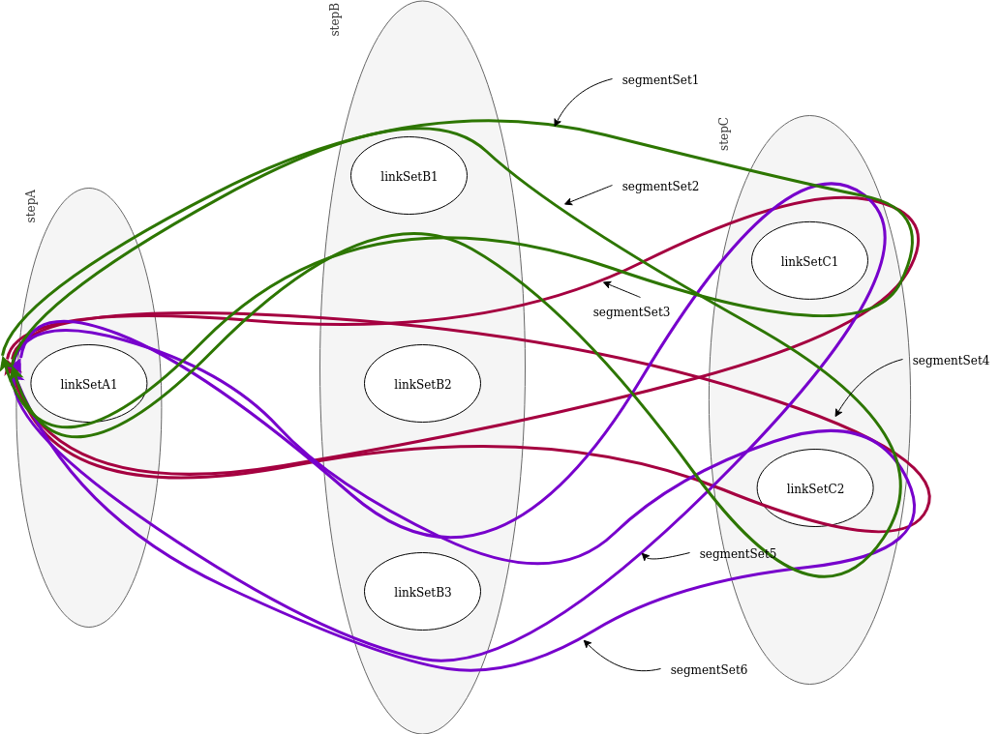

# Verification of the Supply Chain End Products

## Start State

1. There is a SupplyChain defined
2. There are 1 or more active and valid Layouts
    1. The Layouts have only 1 segment
3. A verification request is done with a set of Artifacts
4. The Layouts have a list of expectedEndProducts.

### Verify the Artifacts on the request


An example of a `SupplyChain` with a `Layout`


An example of a use case of a `Layout` with several `Segments`

---
Every Layout is processed until one of them has a valid result.

```
    def processLayouts
        artifacts = request.artifacts
        for every Layout
            result = verifyWithLayout
            if result is valid
                return valid
        return invalid
```
---
The goal of the next phase is to get sets of Link objects of the layout segments which have matched artifacts based on the expected end product match filters and the artifacts in the verification request. The validation will proof which of these different sets has delivered a valid end product.

The clients should set a runId which is as unique as possible. This runId is used to get all Link objects made during a run and is a performance optimization but also necessary to get Link objects on steps or group of steps which don't have any reference to other steps.

```
    def verifyWithLayout
        for every segment with matched artifacts in filters on expectedEndProducts
            runIds = getRunIds
            if runIds empty
                continue (with next expectedEndProducts)
            for every runId in runIds (1)
                links = getLinksWithRunId
                linkSegmentSets = getSegmentLinkSets
        for every set in linkSegmentSets
            result = processRestOfVerification
            if result is valid
                return result
        return invalid
```
1. It is possible that the same end products are available in more than 1 different run of the supply chain with different runId's. For example if the run is only different in a disjunct part of all end products or if runs are not complete. Every runId with it's run should be checked on validity.


---
The next phase `getRunIds` has the following possible outcomes:
1. `|runIds| = 0` -> result is invalid
2. `|runIds| >= 1` -> every runId should be verified

```
    def getRunIds
        runIds = []
        notMatchedArtifacts = artifacts
        stepsWithmatched = {}
        for every matchrule in expectedEndproduct
            matchedArtifacts, notMatchedArtifacts = matchrule.verify(notMatchedArtifacts)
            stepsWithmatched[matchrule.step] = matchedArtifacts
        if notMatchedArtifacts not empty
            return runIds (1)
        runIds = []
        for every step in stepsWithmatched
            runIds.append(runIds in  Links based on artifacts in step)
        return ggd(runIds)
```
1. If after processing all matchrules, there are still not-matched artifacts it means the current set of end products is not valid so continue with the next set

---
The function `getSegmentLinkSets` will group all links per step in equal links and next a permutation will be made over the groups per step this will result in a set of set of links. If links, generated for the same step, are different, even if all have the same runId, they belong to different concrete runs and should be verified independently.



This results in the following sets of link objects to verify

| Segment Set | Link Sets |           |           |
| ----------- | --------- | --------- | --------- | 
| segmentSet1 | linkSetA1 | linkSetB1 | linkSetC1 | 
| segmentSet2 | linkSetA1 | linkSetB1 | linkSetC2 |
| segmentSet3 | linkSetA1 | linkSetB2 | linkSetC1 |
| segmentSet4 | linkSetA1 | linkSetB2 | linkSetC2 |
| segmentSet5 | linkSetA1 | linkSetB3 | linkSetC1 |
| segmentSet6 | linkSetA1 | linkSetB3 | linkSetC2 |


```
    def getSegmentLinkSets
        segmentLinkSets = []
        for every step
            stepLinkSets[step] = group all links on equal links
        tempSegmentSet = []
        for every step in stepLinkSets
            tempSegmentSet = []
            for every linkSet in stepLinkSets[step]
                if segmentLinkSets is empty
                    tempSegmentSet.append(linkSet)
                else
                    for set in segmentLinkSets
                        tempSegmentSet.append(set+linkSet)
            segmentLinkSets = tempSegmentSet
```


---
```
    def processRestOfVerification
        LAYOUT_AUTHORIZED_KEYID
            verifies if the layout is signed with authorized keys 
        LAYOUT_METABLOCK_SIGNATURE
            verifies if layout has a valid signature        
        BUILDSTEPS_COMPLETED
            verifies if every step has at least some link objects
        STEP_AUTHORIZED_KEYID
            verifies if every link on every step is signed with authorized keys
        LINK_METABLOCK_SIGNATURE
            verifies if every link on every step has a valid signature
        EXPECTED_COMMAND
            verifies if the used command on every link on every step is as expected
        RULES
            processes all rules on every step
        REQUIRED_NUMBER_OF_LINKS
            verifies if the the number of links on every step reaches the required number
```
        
    
    

